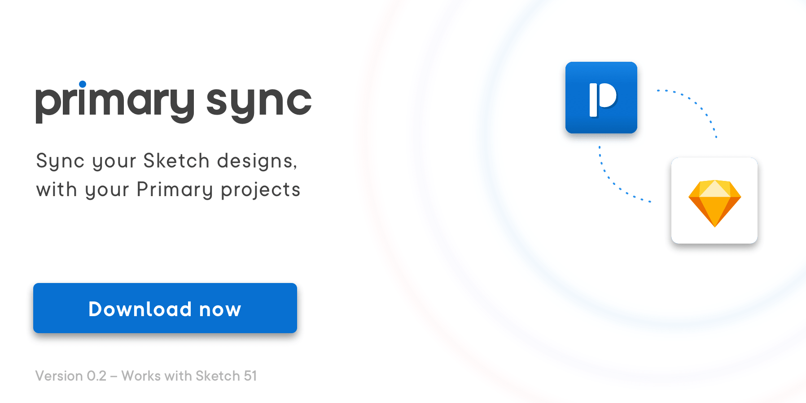

___

## Installation 💻

Double click the downloaded file *primary-sync.sketchplugin* to install the plugin.  

___

Made by the [Primary team](https://www.primary.app/?utm_source=gh&utm_medium=sync&utm_campaign=1) with help from the renowned Sketch plugin developer [@davidwilliames](https://twitter.com/davidwilliames)!

[Primary](https://www.primary.app/?utm_source=gh&utm_medium=sync&utm_campaign=2) is currently only accessible by invite only. If you want to skip the queue and start using Primary in your team's project right now, then send us an email: [hello@primary.app](mailto:hello@primary.app)

## Getting started 📖

#### 1. Design in Sketch
#### 2. Open the Primary sync plugin with (Ctrl ⌃ + Cmd ⌘ + P) or through Sketch Runner
#### 3. Log in to your Primary account and select your project
#### 4. Sync all or just selected artboards
#### 5. See the updated images in Primary's interfaces and user flows

## 4 ways to use the plugin 👇

* Through [Sketch Runner](https://sketchrunner.com/)
* Right click an artboard and select *Sync to Primary*
* With the shortcut (**Ctrl ⌃ + Cmd ⌘ + P**)
* Use the Plugins menu and look for Primary sync

## Bug reporting 🐛
If it's an urgent bug contact us directly [sketchplugin@primary.app](mailto:sketchplugin@primary.app)

If it's a minor bug or feature request then please submit an issue.

___

### "I'm new here, what does Primary do?" 👶

*Primary is an app for creating design documents and user flows that your whole team will understand.*

It's easy to get started with our user flow builder and then showcase them to anyone with our Presentation view. There's also a powerful document export tool to generate and share your designs as markdown or requirements.

If you're still communicating your designs through comments on images then [Primary](https://www.primary.app/?utm_source=gh&utm_medium=sync&utm_campaign=4) was made for you!

**Contact:** [hello@primary.app](mailto:hello@primary.app)

✌️
